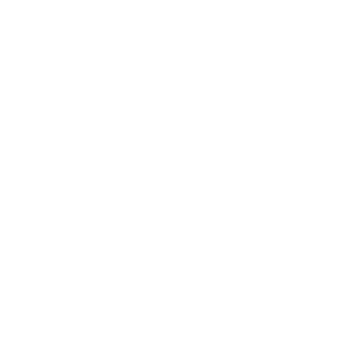
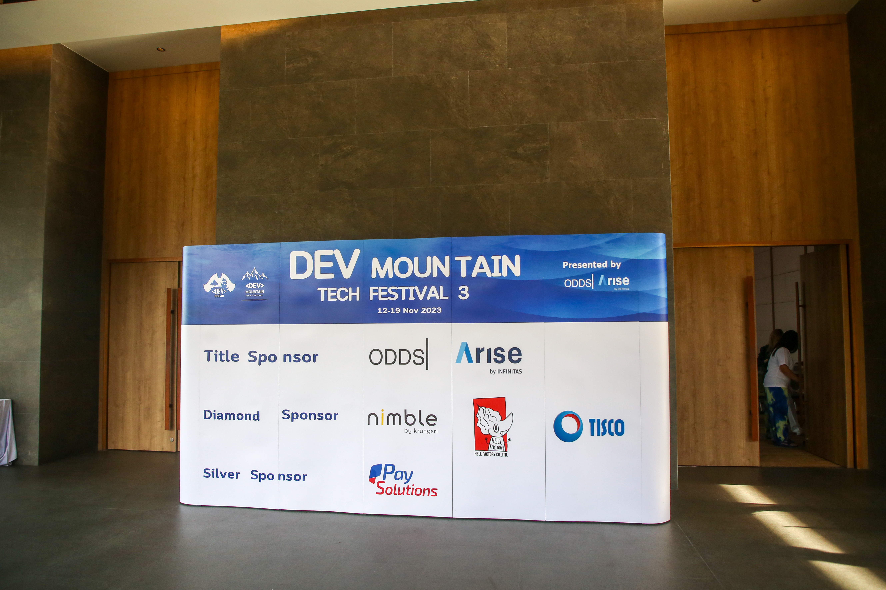
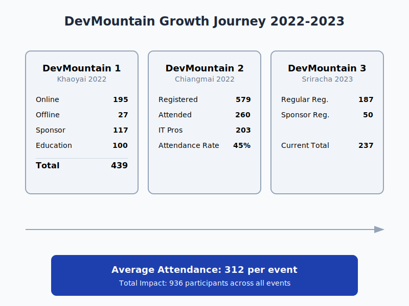
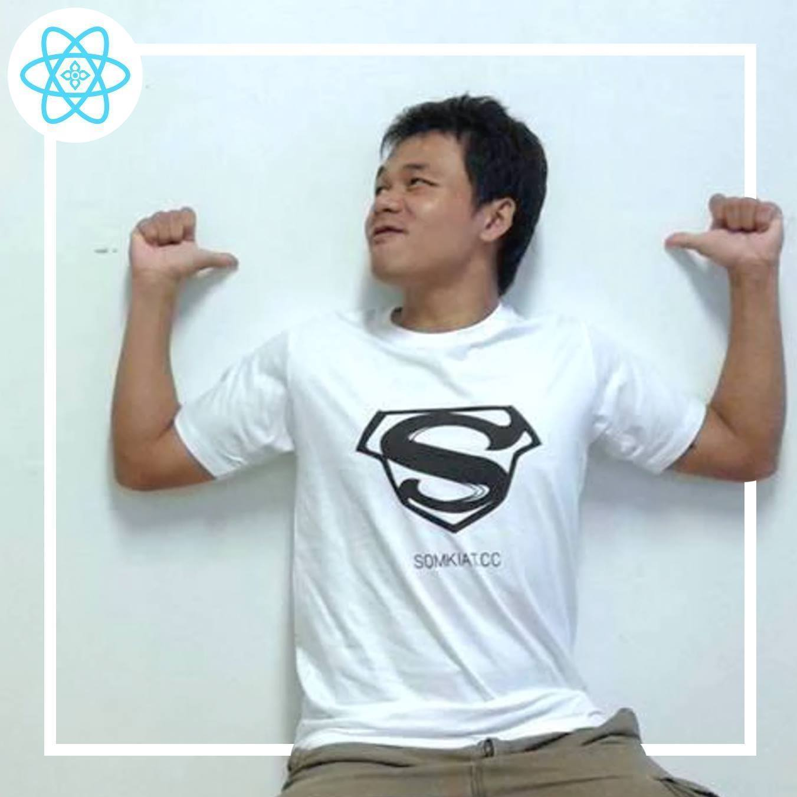
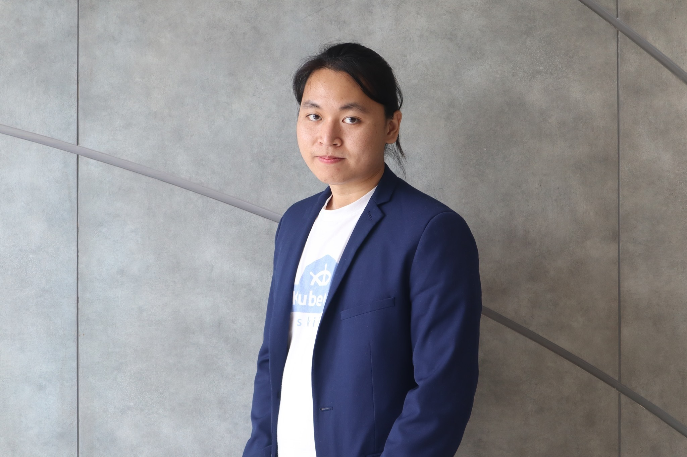
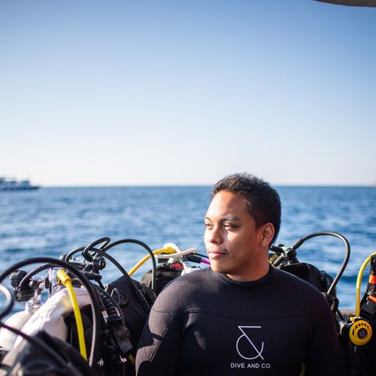
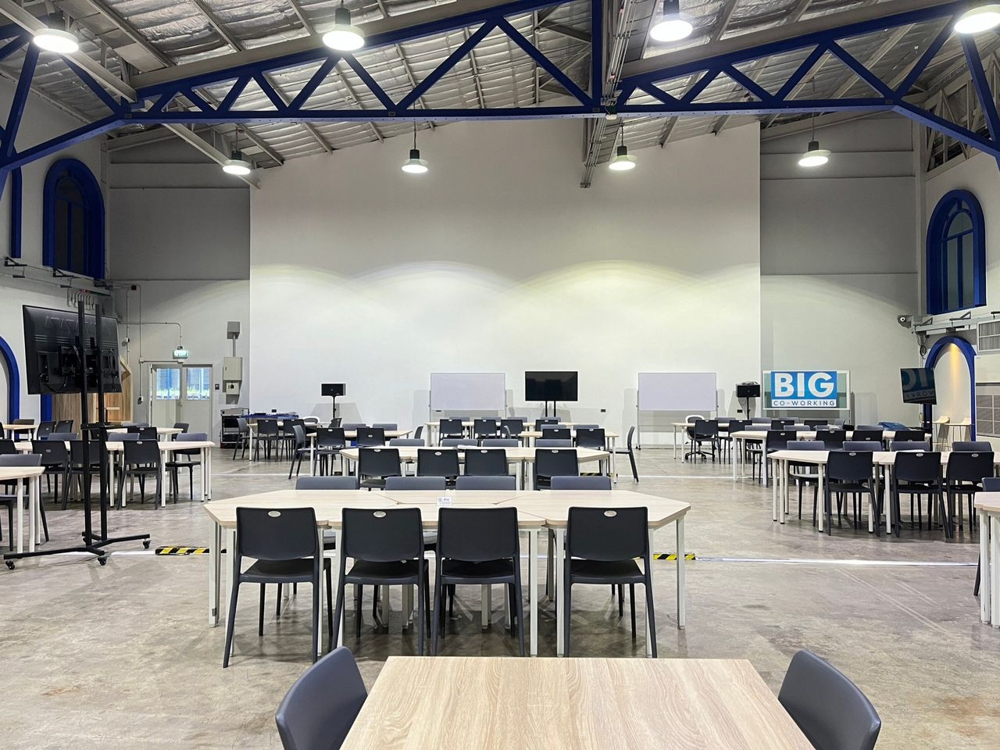
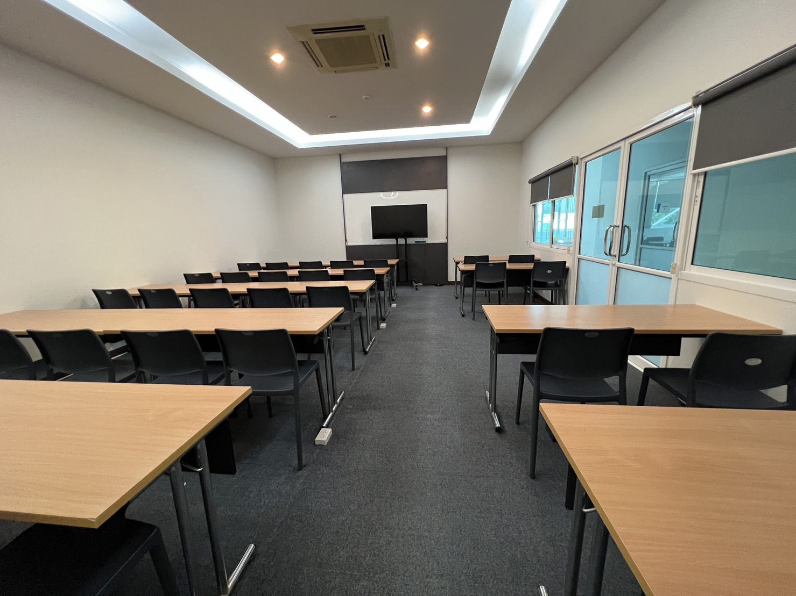

    

# DevMountain Conference 2025
The Dark Side of Tech

&infin; March 2025 @ Big Co-working Space

Your chance to be part of the conversation

---
layout: two-cols
---

# Event Overview

- 🗓️ Full-day conference
- 👥 300+ attendees expected
- 🏢 3 parallel tracks
- 💡 Focus on responsible tech
- 🌟 Industry-leading speakers

::right::

    
    

---
layout: two-cols
---

# Why Sponsor?

🎯 Pioneer in Tech Resilience

🌟 Bridge Knowledge Gaps

🤝 Strengthen Local Tech Community

🛡️ Champion Digital Well-being

🌱 Invest in Future Resilience

::right::

# Audience Profile

- CTOs and Tech Leaders
- Senior Developers
- Security Professionals
- Product Managers
- Industry Innovators
- Students and Educators

---
layout: section
---

    
  

---
layout: section
---

# Speakers

    

        
        <h4 style="font-size: 14px;">Apaichon Punopas</h4> <!-- Updated font size -->
        
Dev Mountain Founder
 <!-- Updated font size -->
    

     

        
        <h4 style="font-size: 14px;">Jirayut Nimsaeng </h4> <!-- Updated font size -->
        
Opsta
 <!-- Updated font size -->
    

    

        
        <h4 style="font-size: 14px;">Sakul Montha</h4> <!-- Updated font size -->
        
Bitkub
 <!-- Updated font size -->
    

     

        
        <h4 style="font-size: 14px;">Salah Chalermthai</h4> <!-- Updated font size -->
        
Throughworks
 <!-- Updated font size -->
    

   

        
        <h4 style="font-size: 14px;">Palakorn Nakphong</h4> <!-- Updated font size -->
        
V Rich
 <!-- Updated font size -->
    

      

        
        <h4 style="font-size: 14px;">Sunai Sukanake </h4> <!-- Updated font size -->
        
BeID
 <!-- Updated font size -->
    

     

        
        <h4 style="font-size: 14px;">Somkiat Puisungnoen</h4> <!-- Updated font size -->
        
SPRINT3r 
 <!-- Updated font size -->
    

    

        
        <h4 style="font-size: 14px;">Supaket Wongkampoo </h4> <!-- Updated font size -->
        
Enersys
 <!-- Updated font size -->
    

    

        
        <h4 style="font-size: 14px;">Saritrat Jirakulphondchai  </h4> <!-- Updated font size -->
        
Jumpbox
 <!-- Updated font size -->
    

     

        
        <h4 style="font-size: 14px;">Natechawin Suthison  </h4> <!-- Updated font size -->
        
R'ket
 <!-- Updated font size -->
    

    

      
        <h4 style="font-size: 14px;">Hacker  </h4> <!-- Updated font size -->
        
Unknown
 <!-- Updated font size -->
    

    

      
        <h4 style="font-size: 14px;">Hacker  </h4> <!-- Updated font size -->
        
Unknown
 <!-- Updated font size -->
    

    

---
layout: section
---

# Location
## Big Co-working Space

| Area      | Room        |
|-----------|:-------------|
|   | Auditorium   Capacity: 300 seats|
|     | Medium Room   Capacity: 100 seats |
|       | Small Room   Capacity: 30 seats |
---
layout: table
---

# Sponsorship Tiers

| Benefit                    | Crown  👑 ฿350,000 | Platinum  🏆 ฿150,000 | Gold  🥇 ฿100,000 | Silver  🥈 ฿50,000 |
|---------------------------|:-------------------:|:-------------------:|:---------------:|:---------------:|
| Speaking Slot             | ✅                  | ✅                  | -               | -               |
| Booth Space               | Premium            | Premium            | Standard        | -          |
| Logo on Materials         | Extra Large        | Large              | Medium          | Small           |
| Conference Passes         | 10                  | 5                  | 3               | 2               |
| Mention in Press Release  | ✅                  | ✅                  | ✅              | -               |
| Social Media Promotion    | ✅                  | ✅                  | ✅              | ✅              |

---
layout: section
---
# Crown Sponsor Benefits

- 50-minute speaking slot in main auditorium
- Company logo prominently displayed on all conference materials
- 10 full conference passes
- Dedicated social media announcements
- Access to opt-in attendee list
- Recognition in opening and closing ceremonies
- Exclusive logo in tech content for 3 months

---
layout: section
---

# Platinum Sponsor Benefits

- 30-minute speaking slot in main auditorium
- Premium exhibition space in high-traffic area
- Company logo prominently displayed on all conference materials
- 5 full conference passes
- Dedicated social media announcements
- Recognition in opening and closing ceremonies

---
layout: section
---

# Gold Sponsor Benefits

- Standard exhibition space
- Company logo on conference materials
- 3 full conference passes
- Social media mentions
- Recognition in opening ceremony

---
layout: section
---

# Silver Sponsor Benefits

- Company logo on conference website
- 2 full conference passes
- Social media mention
- Recognition in conference materials

---
layout: image-right
image: './images/location/special-sponsor.jpeg'
---

# Special Opportunities

## Additional Sponsorship Options

- 🍽️ Lunch Sponsor (฿30,000)
- ☕️ Coffee Break Sponsor (฿10,000)
- 🍺 Beer Sponsor (฿20,000)
- 🎁 Gift Sponsor

---
layout: section
---

# DevMountain Conference 2025 Agenda

## Date: 8 March 2025
## Location: Big Co-working Space

---

# Opening Session

## Auditorium
| Time        | Speaker                     | Topic                                                   |
|-------------|-----------------------------|---------------------------------------------------------|
| 09:00 - 09:45 | Apaichon Punopas           | Keynote: Dark Side Journey in Software Development      |

---

# Morning Sessions

## Auditorium: Software Development Challenges
| Time        | Speaker                     | Topic                                                   |
|-------------|-----------------------------|---------------------------------------------------------|
| 09:45 - 10:30 | Jirayut Nimsaeng           | DevOps Position: Just Support, Not Develop CI/CD       |
| 10:30 - 11:15 | Salah Chalermthai          | Burnout & Depression in the Tech Industry               |
| 11:15 - 12:00 | Palakorn Nakphong         | Darkside App                                           |

---

## Room 2: Business Impact and Growth
| Time        | Speaker                     | Topic                                                   |
|-------------|-----------------------------|---------------------------------------------------------|
| 09:45 - 10:30 | Sunai Sukanake            | Overdue Payments: How They Hinder SME Growth           |
| 10:30 - 11:15 | Somkiat Puisungnoen      | Making Business Impact by Dropping Database in Production|
| 11:15 - 12:00 | Supaket Wongkampoo        | Fire Extinguisher: Completing a 6-Month Project in a Month |

---

## Room 3: Team Dynamics and Development
| Time        | Speaker                     | Topic                                                   |
|-------------|-----------------------------|---------------------------------------------------------|
| 09:45 - 10:30 | Natechawin Suthison       | Bad Attitude: How It Affects Team Performance          |
| 10:30 - 11:15 | Hacker                     | How to Hack Workshop                                    |
| 11:15 - 12:00 | Sakul Montha               | From Software Engineer to Product Owner: Road to Hard Expectations |

---

# Lunch Break: 12:00 - 13:00

---

# Afternoon Sessions

## Auditorium: Software Development Challenges
| Time        | Speaker                     | Topic                                                   |
|-------------|-----------------------------|---------------------------------------------------------|
| 13:00 - 13:45 | TBD                        | TBD                                                     |
| 13:45 - 14:30 | TBD                        | TBD                                                     |
| 14:30 - 15:15 | TBD                        | TBD                                                     |

---

## Room 2: Business Impact and Growth
| Time        | Speaker                     | Topic                                                   |
|-------------|-----------------------------|---------------------------------------------------------|
| 13:00 - 13:45 | Saritrat Jirakulphondchai | Anti-Pattern in K8S: Just a Joke                       |
| 13:45 - 14:30 | TBD                        | TBD                                                     |
| 14:30 - 15:15 | TBD                        | TBD                                                     |

---

## Room 3: Team Dynamics and Development
| Time        | Speaker                     | Topic                                                   |
|-------------|-----------------------------|---------------------------------------------------------|
| 13:00 - 13:45 | TBD                        | TBD                                                     |
| 13:45 - 14:30 | TBD                        | TBD                                                     |
| 14:30 - 15:15 | TBD                        | TBD                                                     |

---

# Closing Remarks: 15:15 - 17:00
## Networking Party

---
layout: center
class: text-center
---

# Contact Us

Ready to make an impact?

Contact our sponsorship team:

apaichon@gmail.com

devmountaintechfest@gmail.com

🌟 Limited spots available - secure yours today!

---
layout: end
---

# Thank You

Let's shape the future of technology together

[Contact Us](mailto:devmountaintechfest@gmail.com)